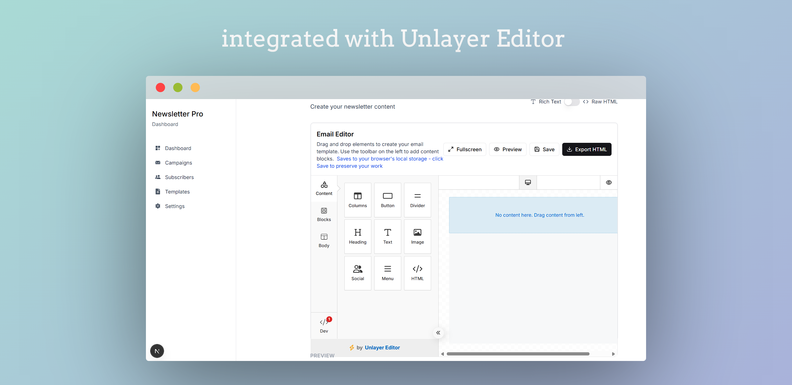
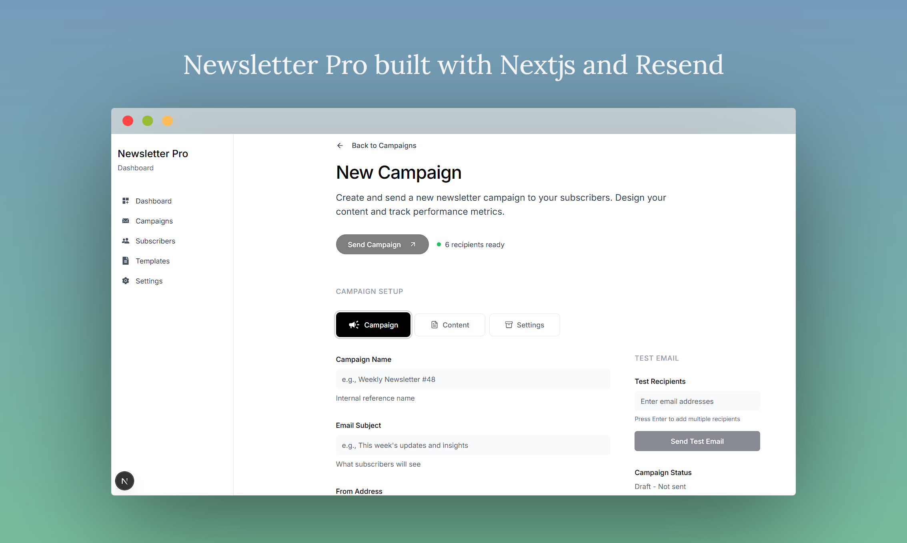

# Newsletter App with Resend.com Integration

A modern newsletter management platform built with Next.js and integrated with Resend.com for reliable email delivery.

## Screenshots

Integrated editor and app screens:





## Features

- 📧 **Email Campaigns**: Create and send beautiful newsletters
- 👥 **Subscriber Management**: Manage your subscriber lists with real Resend.com contacts
- 📊 **Analytics**: Track email performance and engagement
- ⚙️ **Settings**: Configure your email sending preferences
- 🎨 **Rich Text Editor**: Create engaging content with formatting
- 🧪 **Test Emails**: Send test emails before campaigns
- 📱 **Responsive Design**: Works on desktop and mobile
- 🔄 **Real-time Data**: Fetch contacts and audiences from Resend.com
- 📝 **Email Templates**: Create and manage reusable email templates

## Tech Stack

- **Framework**: Next.js 15 with App Router
- **Styling**: Tailwind CSS with shadcn/ui components
- **Email Service**: Resend.com API
- **Language**: TypeScript
- **Icons**: Lucide React

## Getting Started

### Prerequisites

- Node.js 18+ 
- npm or pnpm
- Resend.com account

### Installation

1. **Clone the repository**
   ```bash
   git clone <your-repo-url>
   cd newsletter-app
   ```

2. **Install dependencies**
   ```bash
   npm install
   # or
   pnpm install
   ```

3. **Set up environment variables**
   
   Create a `.env.local` file in the root directory:
   ```env
   # Resend.com API Configuration
   # Get your API key from https://resend.com/api-keys
   RESEND_API_KEY=re_123456789...
   
   # Resend.com Audience Configuration
   # Get your audience ID from https://resend.com/audiences
   RESEND_AUDIENCE_ID=c304ff13-d608-4ab6-af6d-88ffafbd7370
   
   # Email Configuration
   FROM_EMAIL=newsletter@yourdomain.com
   REPLY_TO_EMAIL=support@yourdomain.com
   
   # Application Settings
   NEXT_PUBLIC_APP_NAME=Newsletter App
   NEXT_PUBLIC_APP_URL=http://localhost:3000
   ```

4. **Get your Resend.com credentials**
   
   - Sign up at [resend.com](https://resend.com)
   - Go to API Keys section and create a new API key
   - Go to Audiences section and create a new audience (or use existing)
   - Copy the API key and audience ID to your `.env.local` file

5. **Configure your domain (optional but recommended)**
   
   - In your Resend.com dashboard, go to Domains
   - Add and verify your domain
   - This improves email deliverability

6. **Run the development server**
   ```bash
   npm run dev
   # or
   pnpm dev
   ```

7. **Open your browser**
   
   Navigate to [http://localhost:3000](http://localhost:3000)

## Usage

### Managing Subscribers

1. Go to **Subscribers** to view your real Resend.com contacts
2. Add new subscribers manually - they'll be added to your configured audience
3. View subscriber status (active/unsubscribed)
4. Delete contacts if needed

### Creating Campaigns

1. Navigate to **Campaigns** → **New Campaign**
2. Fill in the campaign details:
   - Campaign title (internal reference)
   - Email subject line
   - Content using the rich text editor
3. Send a test email to verify everything looks correct
4. Send the campaign to all active subscribers from your audience

### Viewing Lists

1. Go to **Subscribers** → **Lists** to view your Resend.com audiences
2. See statistics for each audience
3. Manage audiences through the Resend.com dashboard

### Configuring Settings

1. Visit **Settings** to configure:
   - Resend.com API key
   - Email sending preferences
   - Domain configuration
   - General application settings

## API Routes

The app includes several API routes for email and subscriber functionality:

- `POST /api/email/send` - Send individual emails
- `POST /api/email/test` - Send test emails
- `POST /api/campaigns/send` - Send campaigns to multiple subscribers
- `GET /api/subscribers/contacts` - Fetch contacts from Resend.com
- `POST /api/subscribers/contacts` - Add new contact to Resend.com
- `DELETE /api/subscribers/contacts/[id]` - Delete contact from Resend.com
- `GET /api/subscribers/audiences` - Fetch audiences from Resend.com
- `GET /api/status` - Check API connectivity

## Environment Variables

| Variable | Description | Required |
|----------|-------------|----------|
| `RESEND_API_KEY` | Your Resend.com API key | Yes |
| `RESEND_AUDIENCE_ID` | Your Resend.com audience ID | Yes |
| `FROM_EMAIL` | Default sender email address | No |
| `REPLY_TO_EMAIL` | Default reply-to email address | No |
| `NEXT_PUBLIC_APP_NAME` | Application name | No |
| `NEXT_PUBLIC_APP_URL` | Application URL | No |

## Project Structure

```
newsletter-app/
├── app/                    # Next.js app directory
│   ├── api/               # API routes
│   │   ├── email/         # Email API endpoints
│   │   ├── campaigns/     # Campaign API endpoints
│   │   └── subscribers/   # Subscriber API endpoints
│   ├── campaigns/         # Campaign pages
│   ├── subscribers/       # Subscriber pages
│   ├── settings/          # Settings page
│   └── ...
├── components/            # React components
│   ├── ui/               # shadcn/ui components
│   └── ...
├── hooks/                # Custom React hooks
│   ├── use-email.ts      # Email management hook
│   └── use-subscribers.ts # Subscriber management hook
├── lib/                  # Utility functions
│   └── resend.ts         # Resend.com API client
└── ...
```

## Customization

### Styling

The app uses Tailwind CSS with shadcn/ui components. You can customize the design by:

1. Modifying the `tailwind.config.ts` file
2. Updating component styles in `components/ui/`
3. Adding custom CSS in `app/globals.css`

### Email Templates

To create custom email templates:

1. Create new components in `components/email-templates/`
2. Use the templates in your campaign content
3. Add template variables like `{{name}}` for personalization

### Adding Features

The app is designed to be easily extensible. You can add:

- Database integration for persistent data
- User authentication
- Advanced analytics
- Email automation workflows
- A/B testing for campaigns
- Multiple audience support

## Troubleshooting

### API Key Issues

If you're having trouble with the Resend.com API:

1. Verify your API key is correct
2. Check that your audience ID is correct
3. Ensure your domain is verified in Resend.com
4. Check that your account has sufficient credits
5. Check the browser console for error messages

### Subscriber Issues

- Verify your audience ID is correct in the environment variables
- Check that contacts are being added to the correct audience
- Ensure your audience exists in Resend.com dashboard
- Review Resend.com contact logs

### Email Delivery Issues

- Verify your domain is properly configured in Resend.com
- Check spam folder for test emails
- Ensure your from email address is verified
- Review Resend.com delivery logs

## Contributing

1. Fork the repository
2. Create a feature branch
3. Make your changes
4. Add tests if applicable
5. Submit a pull request

## License

This project is licensed under the MIT License.

## Support

For support with this application:

- Check the [Resend.com documentation](https://resend.com/docs)
- Review the [Next.js documentation](https://nextjs.org/docs)
- Open an issue in this repository

---

Built with ❤️ using Next.js and Resend.com

## Email Template System

### Overview

The email template system provides a comprehensive solution for creating, managing, and using email templates in your newsletter application. It supports both rich text editing and raw HTML editing with real-time preview capabilities.

### Features

#### 🎯 Core Features
- **Rich Text Editor**: Full-featured WYSIWYG editor with formatting tools
- **Raw HTML Editor**: Direct HTML editing for advanced users
- **Real-time Preview**: See how templates will look in emails
- **Template Categories**: Organize templates by type (Newsletter, Marketing, etc.)
- **Search & Filter**: Find templates quickly with search and category filters
- **Inline Editing**: Edit templates directly from the preview
- **Template Usage Tracking**: Track how many times each template has been used

#### 🔧 Technical Features
- **Modular Architecture**: Separated into reusable components
- **Type Safety**: Full TypeScript support with proper interfaces
- **Error Handling**: Comprehensive error handling with user feedback
- **Loading States**: Skeleton loading components for better UX
- **Responsive Design**: Works on all device sizes
- **Server-Side Safety**: API endpoints with proper validation

### Architecture

#### Components Structure

```
components/
├── template-editor.tsx          # Main template creation/editing component
├── template-card.tsx            # Template card for list view
├── template-preview-editor.tsx  # Inline editing with preview
└── rich-text-editor.tsx        # Rich text editing component

hooks/
└── use-templates.ts            # Template management hook

app/
├── templates/
│   ├── page.tsx                # Main templates list
│   ├── loading.tsx             # Loading skeleton
│   ├── new/
│   │   └── page.tsx            # Create new template
│   └── [id]/
│       ├── page.tsx            # Template detail view
│       └── edit/
│           └── page.tsx        # Edit template page
└── api/
    └── templates/
        ├── route.ts             # GET/POST templates
        └── [id]/
            └── route.ts         # GET/PUT/DELETE individual template
```

#### Data Flow

1. **Template Creation**: User creates template → API stores → Hook updates state
2. **Template Editing**: User edits → Preview updates → Save to API → State updates
3. **Template Usage**: User selects template → Navigate to campaign creation
4. **Template Management**: List view → Search/Filter → Actions (Edit/Delete/Use)

### API Endpoints

#### GET /api/templates
Returns all templates
```json
{
  "templates": [
    {
      "id": "string",
      "name": "string",
      "description": "string",
      "category": "string",
      "content": "string",
      "htmlContent": "string",
      "isHtml": "boolean",
      "createdAt": "string",
      "updatedAt": "string",
      "usage": "number"
    }
  ]
}
```

#### POST /api/templates
Creates a new template
```json
{
  "name": "string",
  "description": "string",
  "category": "string",
  "content": "string",
  "htmlContent": "string",
  "isHtml": "boolean"
}
```

#### GET /api/templates/[id]
Returns a specific template

#### PUT /api/templates/[id]
Updates a specific template

#### DELETE /api/templates/[id]
Deletes a specific template

### Usage Examples

#### Creating a Template

```tsx
import { useTemplates } from "@/hooks/use-templates"

const { createTemplate } = useTemplates()

const handleCreate = async () => {
  await createTemplate({
    name: "Weekly Newsletter",
    description: "Standard weekly newsletter template",
    category: "Newsletter",
    content: "<h1>Hello {{name}}!</h1>",
    htmlContent: "<html><body><h1>Hello {{name}}!</h1></body></html>",
    isHtml: false
  })
}
```

#### Using the Template Editor

```tsx
import { TemplateEditor } from "@/components/template-editor"

<TemplateEditor
  template={existingTemplate} // Optional for editing
  onSave={handleSave}
  onCancel={handleCancel}
  loading={loading}
/>
```

#### Template Preview with Inline Editing

```tsx
import { TemplatePreviewEditor } from "@/components/template-preview-editor"

<TemplatePreviewEditor
  template={template}
  onSave={handleSave}
  onCancel={handleCancel}
  loading={loading}
/>
```

### Template Variables

The system supports template variables that will be replaced when sending emails:

- `{{name}}` - Subscriber's name
- `{{email}}` - Subscriber's email
- `{{unsubscribe_url}}` - Unsubscribe link
- `{{company_name}}` - Your company name

### Security Considerations

#### Client-Side Safety
- All user inputs are validated before sending to API
- Rich text editor sanitizes HTML content
- XSS protection through proper content sanitization

#### Server-Side Safety
- API endpoints validate all required fields
- Input sanitization on server side
- Proper error handling and logging

### Performance Optimizations

1. **Lazy Loading**: Templates are loaded only when needed
2. **Caching**: Template data is cached in the hook state
3. **Debounced Search**: Search input is debounced to prevent excessive API calls
4. **Skeleton Loading**: Loading states provide better perceived performance

### Future Enhancements

#### Planned Features
- **Template Versioning**: Track changes and rollback to previous versions
- **Template Analytics**: Track open rates, click rates per template
- **Template A/B Testing**: Test different versions of templates
- **Template Import/Export**: Import templates from external sources
- **Template Collaboration**: Multiple users can edit templates
- **Template Approval Workflow**: Approval process for template changes

#### Technical Improvements
- **Database Integration**: Replace in-memory storage with proper database
- **Real-time Collaboration**: WebSocket support for live editing
- **Template Validation**: Validate template syntax and variables
- **Bulk Operations**: Select and edit multiple templates at once

### Troubleshooting

#### Common Issues

1. **Template not saving**: Check if all required fields are filled
2. **Preview not updating**: Ensure content is not empty
3. **Rich text editor not working**: Check browser compatibility
4. **API errors**: Verify network connection and server status

#### Debug Mode

Enable debug mode by adding `?debug=true` to any template URL to see additional information.

### Contributing to Template System

When contributing to the template system:

1. Follow the existing component structure
2. Add proper TypeScript types
3. Include error handling
4. Add loading states
5. Test on different screen sizes
6. Update documentation

### Dependencies

- **React**: UI framework
- **Next.js**: Full-stack framework
- **TypeScript**: Type safety
- **Tailwind CSS**: Styling
- **Lucide React**: Icons
- **Radix UI**: Accessible components